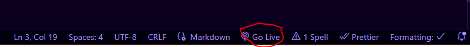

# les bases de Javascript + HTML

Dans ce cours, nous allons voir les bases de l'HTML et comment manipuler ce dernier avec Javascript.
Nous allons afficher une variable dynamique dans la page HTML et avoir une influence dessus.

## Lancer le cours

clique sur le bouton "Go Live" en bas à gauche de VSCODE pour lancer le projet dans ton navigateur !

La page HTML va être exécuté dans ton navigateur, ce qui est "codé" à l'intérieur apparaîtra de façon interprété.

Lis les commentaires dans le fichier HTML pour savoir ce que toutes les lignes font, j'ai pas écrit la vérité absolue, seulement
ce qui est important à comprendre.